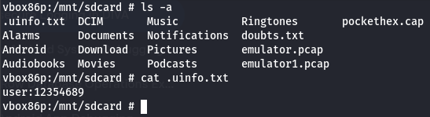

Using jadx understanding the source code we can come to a conclusion that we are creating a new hidden file (has a dot infornt of it) in the called unifo in phones extrernal storage from where can conclude that  ` File sdir = Environment.getExternalStorageDirectory();`
so we mount sd card in adb shell and try to find the file using ls -a since its a hidden file
`cd /mnt/sdcard`
ls -a to view hidden files
and you will find the file unifo.txt

<empty-block/>
<empty-block/>
as a developer i would not store the files in external storage instead i would store apps sandbox
and if it has to be in sd card i would encrypt with password with jet pack security library