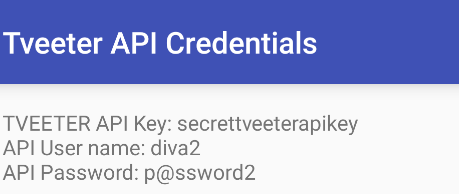

After clicking the view tveeter api credintials and finding which activity is being displayed on the screen and found its APICreds2Activity

so tried to start it manually using adb shell am start -n jahkeer.assem.diva/jhakeer.aseem.diva.APICreds2Activity but it started the View_CREDS2 activity which means the activity is being protected so after understanding the code from jadx found that its comparing with a string chk_pin in resources check_pin 

Found that we can add flags for intent to starting an activity and for this specific level the flag is **--ez (extra_key extra_boolean_value) **we know the extra key its check_pin and we are setting the boolean value as false saying that skip checking the key and launch the activity

the exact command for this challenge is `adb shell am start -n jakhar.aseem.diva/.APICreds2Activity -a jakhar.aseem.diva.action.View_CREDS2 --ez check_pin false`

ref: [https://developer.android.com/tools/adb#IntentSpec](https://developer.android.com/tools/adb#IntentSpec)

i would encrypt the password using jet pack library or using hash instead of storing it in resources for maximum encryption