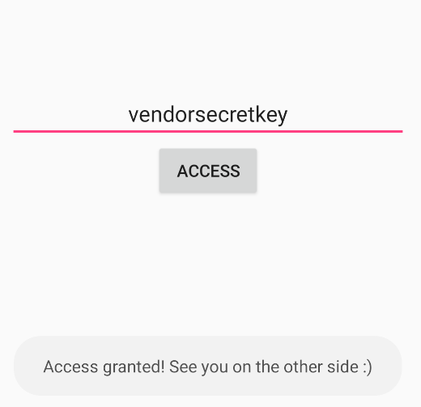
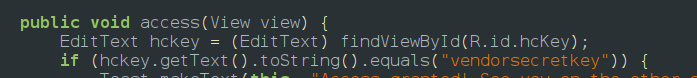

open the jadx and upload apk find the activity which is responsible for hardcoding by the command
adb shell dumpsys window \| grep mCurrentFocus
then go to the actvity and find the hardcoded value to which it is being compared

if i would solve this i would store the key in native c files or strings or hash them and then use the hash to compare the users input to the hash
<empty-block/>