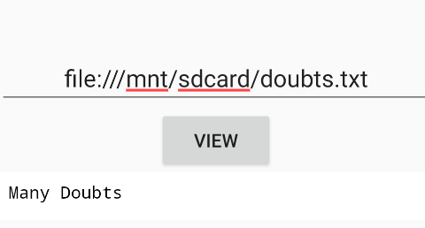

we have to find any sensitive information apart from web url one of the way is we can access the systems internal files using file protocol
<empty-block/>
so there is a file called doubts.txt so we can read the files information using this url
file:///mnt/sdcard/doubts.txt

the general syntax is file:///\<path_to_file\>
<empty-block/>
we can fix this by changing the code `wset.setJavaScriptEnabled(true);`
to false because JavaScript is enabled, an attacker can type `javascript:alert(document.cookie)` or more malicious scripts into the URL bar. The WebView will execute that code in the context of the application, potentially stealing session [data](http://data.java) java script can be used to read local values 
we can add few lines of codes while creating webview 
wset.setAllowFileAccess(false); 
wset.setAllowContentAccess(false);
which doesnt allow webview to load files
<empty-block/>
also we can add few if else conditions 
if (input.startsWith("https://")) \{
wview.loadUrl(input);
\} else \{
Toast.makeText(this, "Only HTTPS is allowed", 0).show();
\}
<empty-block/>