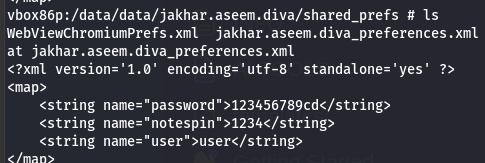
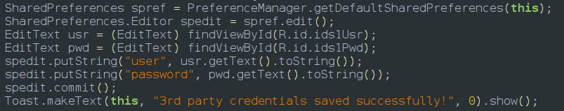

In the jadx viewed the activity Insecure Data Storage1 and found that the details of the user are being stored in shared preferences
so used adb shell to login as root and then went to the folder which is the location in 
/data/data/jakhar.aseem.diva/shared_prefs
and if we read this file using cat we can see the users information and password
the shared pref are stored as key values

if i would solve this i would store the key in native c files or strings or hash them instead of storing them in shared prefrences or i will use jet pack security library to encrypt both the keys and values and store them 

and there is one more vulnerablity android allow back up is true if the attacker has the users google account he can retrive the data 
