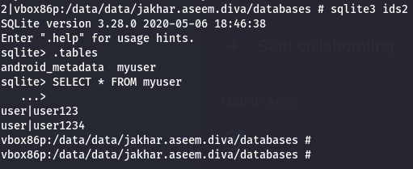

Opening insecure data storage part2 we can see the data is being stored in data base
so we will try to read apps data base
the path for data base will be /data/data/jakhar.aseem.diva and we can see the database files and this exact line tells us in what data base file the information is exactly is being stored
`this.mDB = openOrCreateDatabase("ids2", 0, null);`
so the info is being created a database ids2 and stored in ids2
we use sqllite 3 to view it by `sqlite3 ids2` and since the database is a type of tables and we use `.tables` to view the different sets of tables and there is a table called my user 
to view the data in table we use `SELECT * FROM myuser;` where \* represent all the rows and columns

my user is the table name and ids2 is the database name
`this.mDB = openOrCreateDatabase("ids2", 0, null);`
where 0 tells us there is no access to other apps in the file to get the files from data base and null tells us to use set based operations instead of looking at one row at a time search all the rows at a time

as a developer i would fix this issue using sql cipher or create a key to db to encrypt data base 
or i would use place holders instead of giving input as a string to data base directly