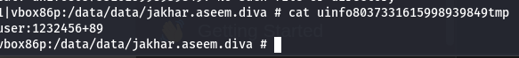

After understanding the source code we can come to conclusion that the user info and credintials are being written to a new file called unifo which we can confirm using this line of code 
where tmp is temporary file stored in the app files and unifo is the file name 
`File uinfo = File.createTempFile("uinfo", "tmp", ddir)`
we can go to /data/data/jakheer.aseem.diva
and we can find the unifo file and we can use cat command to view the file contents

the vulnerability is even though the file is used temporarily it is stored in the external directory with strings containing in it as an attacker we could just read the file 

since its temporary i would also prefer storing them in cache if the memory of the phone runs low the phone might actually delete it or use jet pack security library to encrypt them