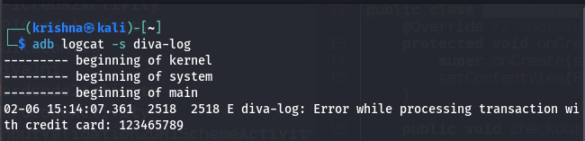

# import android.util.Log;
if this import is present in the imports which means the actvitiy info is stored in log buffers
# how to view that one logcat of diva apk instead of whole system
adb logcat -s diva-log
where -s makes everything silent except diva apks logs
in the logs you find your credit card number

to solve this vulnerability i would remove displaying the users input from the log message