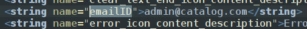
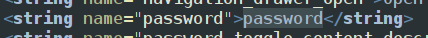
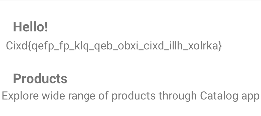
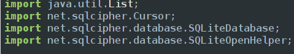
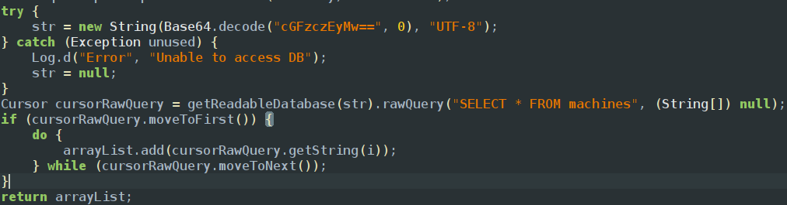
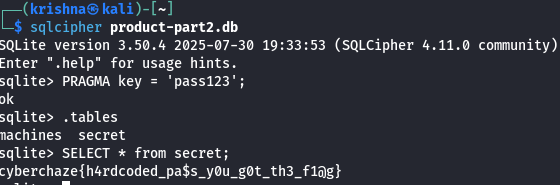

As the first step we explore android manifest xml and then check for activities which are exported as true
When we open the app it asks for email and password so we explore login activity and find the email and password are compared to strings in xml files

hence the email is admin@catalog.com

hence the password is password
if we login using these credentials we login into the app and we get a fake flag

the above is in cipher if we decode it we get Flag\{this_is_not_the_real_flag_look_around\}
so explored every activity one by one and found dbutils in which they mentioned they used SQL cipher we can look from imports

SQL cipher helps us to lock database using a password we can find the password in the app which is encode in base64 

if we decode it we get the password because that is being checked to make queries 
the decoded password is pass123 
we adb shell to retrieve data from the db we have 2 db products1.db and products2.db so i pulled both the db into my storage since we cant use SQL cipher in emulator and i pulled it to my local storage and used sql storage on both the db with key given as 
PRAGMA key = ‘pass123’
and found out product-part2.db has a table called secrets so to retrieve all the info in secrets table we can use SELECT \* from secret which gives us all rows and columns in the table and found the flag

<empty-block/>