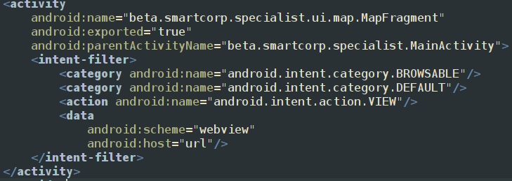
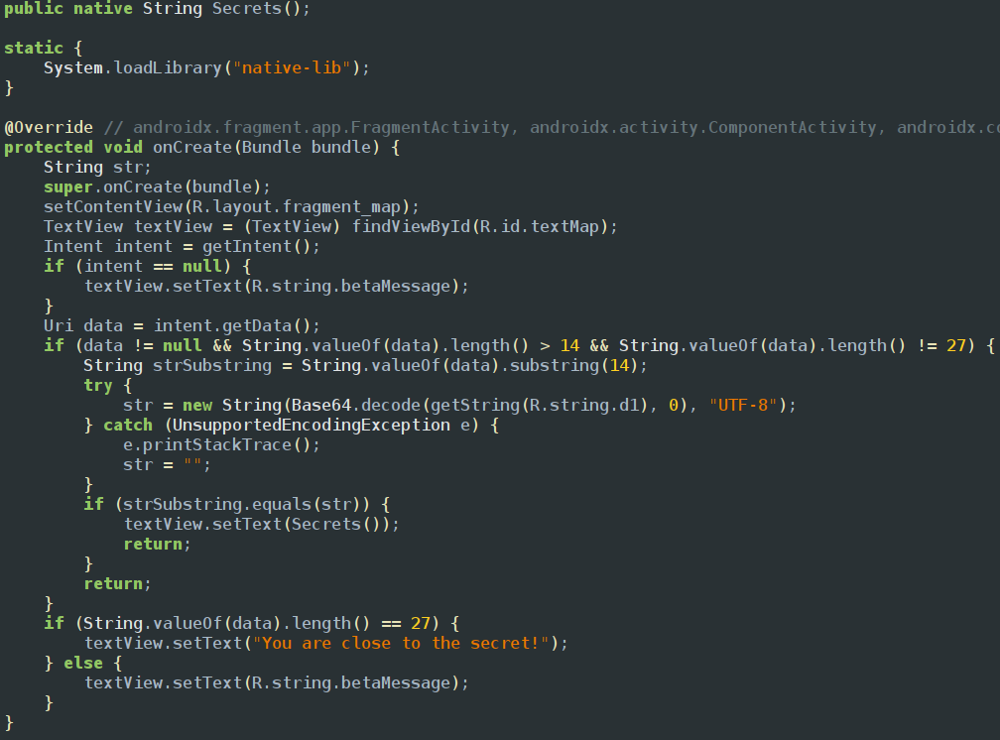
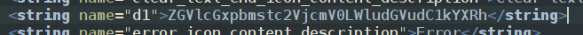
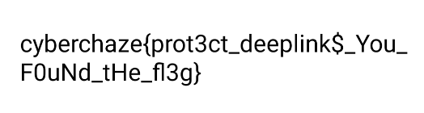

When we explore android manifest xml

we can see that this activity can handle urls and it is exported as true so we could use adb to start the activity

the app loads a native library function which is called secrets and its waiting for an intent which is has length greater than 14 but not equal to 27
so it then creates a substring of length 14 and comparing with string which is encoded in base64 in resources strings file 

so the decoded string is deeplink-secret-intent-data
this must be the password and if we look at the scheme is webview and host is url so we create an adb command with url and action intent view and get the flag 
adb shell am start -n beta.smartcorp.specialist/.ui.map.MapFragment -a android.intent.action.VIEW 
-d "webview://url/deeplink-secret-intent-data"

The other way to solve this challenge is you could load native files in ghidra and there are 3 tmp function which are being load in the main function which is verify 
and when we explore it there are 3 strings that are being concatinated together each string in hex format if you reverse them and join you will get the flag
