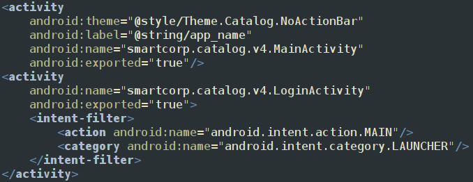
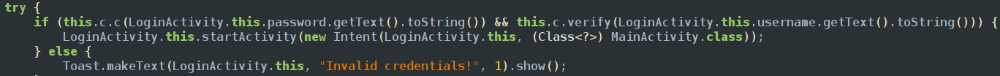
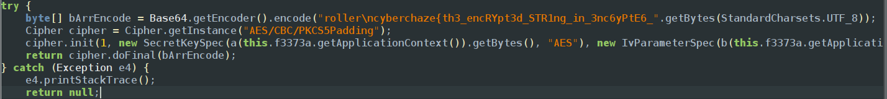
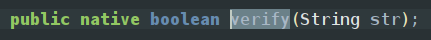
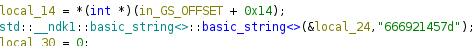
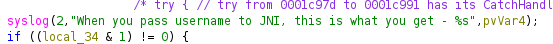

As we look into android manifest we can 2 activities which are exported 

so analysing the login activity we can find there are strings username and password which we can enter and its being compared 
username is being compared by a function verify which is in native library and password is being compared by a function crypto which exists in crypto class 

after randomly exploring in jadx we found a peice of the flag which is incomplete

also there is an function which is in native files which is used to compare username

after loading the native files in ghidra and exploring in the native verify function and found hex code
and when we decode it we get f!lE\} which has a closed bracket which we can assume that the flag is cyberchaze\{th3_encRYpt3d_STR1ng_in_3nc6yPtE6_f!lE\}
 

and the code does nothing with it it just retruns -1 

<empty-block/>